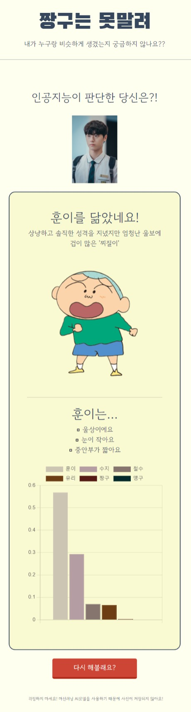

# img_recognition_webapp

https://minji0123.github.io/img_recognition_webapp/

Web 관련 지식을 쌓은 후,   
실제로 돌아가는 서비스를 만들어 보고 싶어서 제작해본 웹 앱입니다.😃    

닮은 꼴 테스트가 유행하는 점을 참고해서    
만화 캐릭터(짱구) 닮은 꼴 웹앱을 만들었습니다.   

